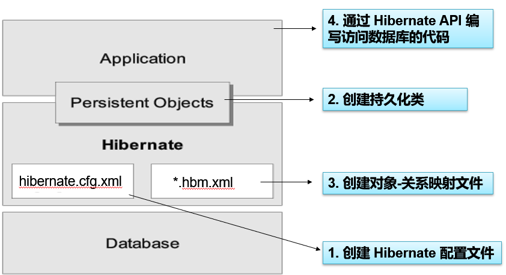
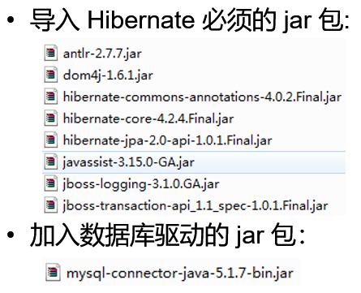
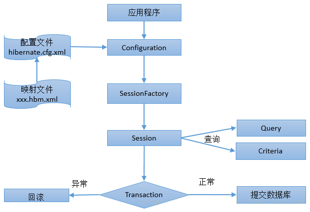
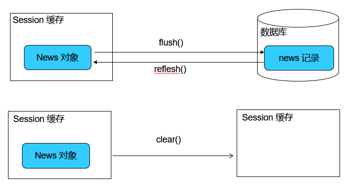
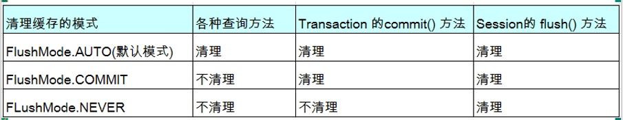
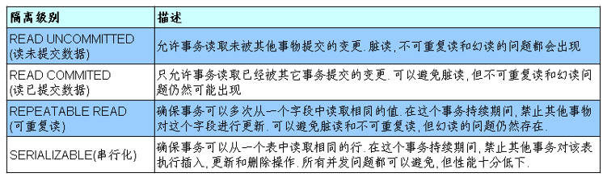
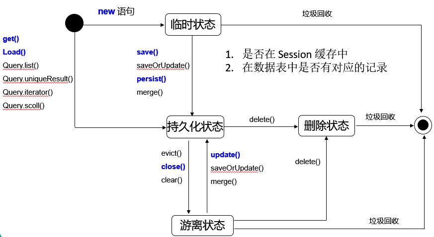
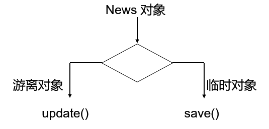
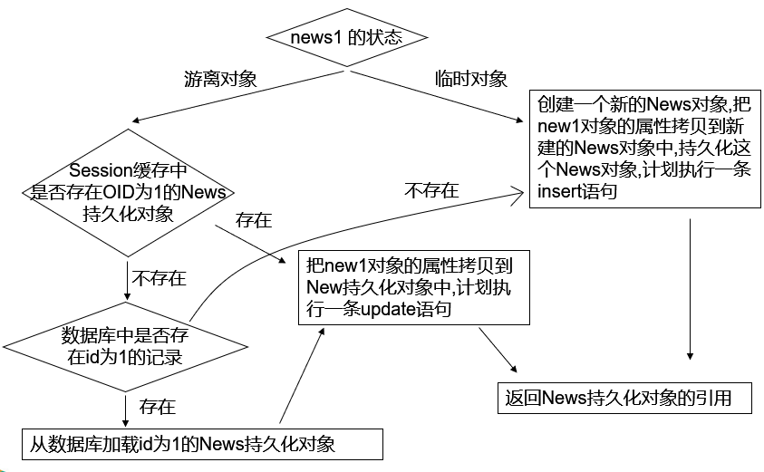

# Hibernate入门学习

​	本文主要讲的是Hibernate的入门知识。

## 目录

* [Hibernate入门学习](#hibernate%E5%85%A5%E9%97%A8%E5%AD%A6%E4%B9%A0)
  * [目录](#%E7%9B%AE%E5%BD%95)
  * [什么是Hibernate？什么是ORM？](#%E4%BB%80%E4%B9%88%E6%98%AFhibernate%E4%BB%80%E4%B9%88%E6%98%AForm)
  * [Hibernate开发步骤](#hibernate%E5%BC%80%E5%8F%91%E6%AD%A5%E9%AA%A4)
  * [准备Hibernate环境](#%E5%87%86%E5%A4%87hibernate%E7%8E%AF%E5%A2%83)
  * [Hibernate核心接口及工作原理](#hibernate%E6%A0%B8%E5%BF%83%E6%8E%A5%E5%8F%A3%E5%8F%8A%E5%B7%A5%E4%BD%9C%E5%8E%9F%E7%90%86)
  * [Session概述](#session%E6%A6%82%E8%BF%B0)
    * [flush()、refresh()、clear()](#flushrefreshclear)
    * [设定刷新缓存的时间点](#%E8%AE%BE%E5%AE%9A%E5%88%B7%E6%96%B0%E7%BC%93%E5%AD%98%E7%9A%84%E6%97%B6%E9%97%B4%E7%82%B9)
  * [数据库的隔离级别](#%E6%95%B0%E6%8D%AE%E5%BA%93%E7%9A%84%E9%9A%94%E7%A6%BB%E7%BA%A7%E5%88%AB)
    * [Hibernate的持久化对象](#hibernate%E7%9A%84%E6%8C%81%E4%B9%85%E5%8C%96%E5%AF%B9%E8%B1%A1)
  * [Session的常用方法](#session%E7%9A%84%E5%B8%B8%E7%94%A8%E6%96%B9%E6%B3%95)
    * [save()](#save)
    * [get()和load()](#get%E5%92%8Cload)
    * [update()](#update)
    * [saveOrUpdate()](#saveorupdate)
    * [merge()](#merge)
    * [Session的delete()方法](#session%E7%9A%84delete%E6%96%B9%E6%B3%95)

## 什么是Hibernate？什么是ORM？


​	Hibernate是一个ORM框架（Object Relative DateBase Mapping），在Java对象与关系数据库之间建立某种映射，以实现直接存取Java对象。

## Hibernate开发步骤



1. 创建Hibernate配置文件  hibernate.cfg.xml

   ```java
   <?xml version="1.0" encoding="UTF-8"?>
   <!DOCTYPE hibernate-configuration PUBLIC
   		"-//Hibernate/Hibernate Configuration DTD 3.0//EN"
   		"http://hibernate.sourceforge.net/hibernate-configuration-3.0.dtd">
   <hibernate-configuration>
   	<session-factory>
       
   		<!-- 配置连接数据库的基本信息：驱动、数据库地址、账户、密码 -->
   		<property name="connection.username">root</property>
   		<property name="connection.password">1234</property>
   		<property name="connection.driver_class">com.mysql.jdbc.Driver</property>
   		<property name="connection.url">jdbc:mysql://localhost/hibernate</property>
   		
   		<!-- 配置 hibernate 的基本信息 -->
   		<!-- hibernate 所使用的数据库方言,告诉Hibernate用什么数据库、什么引擎 -->
   		<property name="dialect">org.hibernate.dialect.MySQLInnoDBDialect</property>		
   		
   		<!-- 执行操作时是否在控制台打印 SQL -->
   		<property name="show_sql">true</property>
   	
   		<!-- 是否对 SQL 进行格式化：方便阅读SQL -->
   		<property name="format_sql">true</property>
   	
   		<!-- 指定自动生成数据表的策略：自动生成数据表 -->
   		<property name="hbm2ddl.auto">update</property>
   		
   		<!-- 指定关联的 .hbm.xml 文件 -->
   		<mapping resource="com/atguigu/hibernate/helloworld/News.hbm.xml"/>
   	
   	</session-factory>

   </hibernate-configuration>
   ```

2. 创建持久化类

   ```java
         package com.atguigu.hibernate.helloworld;

         import java.sql.Blob;
         import java.util.Date;

         public class News {
         	
         	private Integer id;
         	private String title;
         	private String author;
           	private Date date;
           
         	public Integer getId() { 
         		return id;
         	}

         	public void setId(Integer id) {
         		this.id = id;
         	}

         	public String getTitle() {
         		return title;
         	}

         	public void setTitle(String title) {
         		this.title = title;
         	}

         	public String getAuthor() {
         		return author;
         	}

         	public void setAuthor(String author) {
         		this.author = author;
         	}

         	public Date getDate() {
         		return date;
         	}

         	public void setDate(Date date) {
         		this.date = date;
         	}

         	public News(String title, String author, Date date) {
         		super();
         		this.title = title;
         		this.author = author;
         		this.date = date;
         	}
         	
         	public News() {
         		// TODO Auto-generated constructor stub
         	}

         	@Override
         	public String toString() {
         		return "News [id=" + id + ", title=" + title + ", author=" + author
         				+ ", date=" + date + "]";
         	}
         	
         }
   ```


3. 创建对象--关系映射文件  *.hbm.xml

   ```java
   <?xml version="1.0"?>
   <!DOCTYPE hibernate-mapping PUBLIC "-//Hibernate/Hibernate Mapping DTD 3.0//EN"
   "http://hibernate.sourceforge.net/hibernate-mapping-3.0.dtd">

   <hibernate-mapping package="com.atguigu.hibernate.helloworld">

       <class name="News" table="NEWS" dynamic-insert="true">
       	
           <id name="id" type="java.lang.Integer">
               <column name="ID" />
               <!-- 指定主键的生成方式, native: 使用数据库本地方式 -->
               <generator class="native" />
           </id>
       
           <property name="title" not-null="true" unique="true"
           	index="news_index" length="50"
           	type="java.lang.String" column="TITLE" >
           </property>
           
           <property name="author" type="java.lang.String"
           	index="news_index">
               <column name="AUTHOR" />
           </property>
           
           <property name="date" type="date">
               <column name="DATE" />
           </property>
           
           <property name="desc" 
           	formula="(SELECT concat(title, ',', author) FROM NEWS n WHERE n.id = id)"></property>
   		
   		<property name="content">
   			<column name="CONTENT" sql-type="text"></column>
   		</property>
   		
   		<property name="picture" column="PICTURE" type="blob"></property>
   		
       </class>
       
   </hibernate-mapping>
   ```

4. 通过Hibernate API编写访问数据的代码

   ```java
   package com.atguigu.hibernate.helloworld;

   import java.sql.Date;

   import org.hibernate.Session;
   import org.hibernate.SessionFactory;
   import org.hibernate.Transaction;
   import org.hibernate.cfg.Configuration;
   import org.hibernate.service.ServiceRegistry;
   import org.hibernate.service.ServiceRegistryBuilder;
   import org.junit.Test;

   public class HibernateTest {

   	@Test
   	public void test() {
   		
   		System.out.println("test...");
   		
   		//1. 创建一个 SessionFactory 对象
   		SessionFactory sessionFactory = null;
   		
   		//1). 创建 Configuration 对象: 对应 hibernate 的基本配置信息和 对象关系映射信息
   		Configuration configuration = new Configuration().configure();
   		
   		//版本4.0 之前这样创建
   //		sessionFactory = configuration.buildSessionFactory();
   		
   		//2). 创建一个 ServiceRegistry 对象: hibernate 4.x 新添加的对象
   		//hibernate 的任何配置和服务都需要在该对象中注册后才能有效.
   		ServiceRegistry serviceRegistry = 
   				new ServiceRegistryBuilder().applySettings(configuration.getProperties())
   				                            .buildServiceRegistry();
   		
   		//3).
   		sessionFactory = configuration.buildSessionFactory(serviceRegistry);
   		
   		//2. 创建一个 Session 对象
   		Session session = sessionFactory.openSession();
   		
   		//3. 开启事务
   		Transaction transaction = session.beginTransaction();
   		
   		//4. 执行保存操作
   		News news = new News("Java12345", "ATGUIGU", new Date(new java.util.Date().getTime()));
   		session.save(news);
   		
   		//5. 提交事务 
   		transaction.commit();
   		
   		//6. 关闭 Session
   		session.close();
   		
   		//7. 关闭 SessionFactory 对象
   		sessionFactory.close();
   	}
   }
   ```


## 准备Hibernate环境

- 导入Hibernate必须的jar包



- 导入数据库驱动的jar包


## Hibernate核心接口及工作原理



- Configuration：负责管理配置信息并启动Hibernate，创建SessionFactory。
- SessionFactory：负责初始化Hibernate，创建session对象
- Session：负责被持久化对象的CRUD操作。是一个单线程对象。
  - 获得持久化对象的方法：get()、load()
  - 持久化对象的保存，更新和删除：save()、update()、saveOrUpdate()、delete()
  - 开启事务：beginTransaction()
  - 管理Session的方法：isOpen()、flush()、clear()、evict()、close()
- Query和Criteria接口：负责执行各种数据库查询
- Transaction：负责事务相关的操作
  - commit()：提交相关联的session实例
  - rollback()：撤销事务操作
  - wasCommitted()：检查事务是否提交


```java
//1.通过Configuration来读取配置文件hibernate.cfg.xml
//由hibernate.cfg.xml中的<mapping resource="com/xx/User.hbm.xml"/>读取并解析映射信息
Configuration config = new Configuration().configure();
//2.创建一个 ServiceRegistry 对象
ServiceRegistry serviceRegistry = new ServiceRegistryBuilder().applySettings(configuration.getProperties()).buildServiceRegistry();
//3.在ServiceRegistry中注册SessionFactory
SessionFactory sessionFactory = configuration.buildSessionFactory(serviceRegistry);
//4. 创建一个 Session 对象
Session session = sessionFactory.openSession();
//5. 开启事务
Transaction transaction = session.beginTransaction();
//6. 执行保存操作
News news = new News("Java12345", "ATGUIGU", new Date(new java.util.Date().getTime()));
session.save(news);
//7. 提交事务 
transaction.commit();
//8. 关闭 Session
session.close();
//9. 关闭 SessionFactory 对象
sessionFactory.close();
```

## Session概述

​	Hibernate的Session接口是Hibernate向应用程序提供的操纵数据库的最主要的接口，它提供了基本的保存，更新，删除和加载Java对象的方法（上一小节有提到）。

​	Session具有一个缓存，位于缓存中的对象成为持久化对象，它和数据库中的相关记录对应。Session能够在某些时间点，按照缓存中对象的变化来执行相关的SQL语句，来同步更新数据库，这一过程被陈伟刷新缓存（flush）。

​	站在持久化的角度，Hibernate把对象分为4种状态：持久化状态、临时状态，游离状态、删除状态。Session的特定方法能使对象从一个状态转换到另一个状态。

​	在Session接口的实现中包含一系列的Java集合，这些集合构成了Session缓存。只要Session实例没有结束生命周期，且没有清理缓存，则存放在它缓存中的对象也不会结束生命周期。Session缓存可以减少Hibernate应用程序访问数据库的频率。


```java
New news = (News)session.get(News.class, 1);
System.out.println(news);

New news2 = (News)session.get(News.class, 1);
System.out.println(news2);

System.out.println(news == news2);
//结果为1
//Hibernate在查询的时候回将对象存入session缓存中
```

### flush()、refresh()、clear()

​	flush()：Session 按照缓存中对象的属性变化来同步更新数据库

​	refresh()：会强制发送select语句，以使session缓存中对象的状态和数据表中对应的记录保持一致。该方法的有效性需要配置事务的隔离级别为read commited(读已提交)。

​	clear()：清除session中的缓存数据（不管缓存与数据库的同步）。



### 设定刷新缓存的时间点




## 数据库的隔离级别

​	对于同时运行的多个事务，当这些事务访问数据库中相同的数据是，如果没有采取必要的隔离机制，就会导致各种并发问题：

- 脏读：事务T1和T2。T1读取了已经被T2更新但还没有被提交的字段，若之后T2回滚，T1读取的内容就是临时且无效的。
- 不可重复度：事务T1和T2。T1读取了一个字段，然后T2更新了该字段，之后，T1再次读取同一个字段，值就不同了。
- 幻读：事务T1和T2。T1 从一个表中读取了一个字段，然后T2在该表中插入了一些新的行，之后,如果T1再次读取同一个表，就会多出几行。




### Hibernate的持久化对象

​	前面的章节有提起过：

​	站在持久化的角度，Hibernate把对象分为4种状态：持久化状态，临时状态，游离状态，删除状态。Session的特定方法能使对象从一个状态切换到另个状态。



- 临时对象（Transient）：
  - 在使用代理主键的情况下，OID通常为null
  - 不处于Session的缓存中
  - 在数据库中国没有对应的记录
- 持久化对象（也叫“托管”）（Persist）：
  - OID不为null
  - 位于Session缓存中
  - 若在数据库中已有与其对应的记录，持久化对象和数据库中的相关记录对应
  - Session在flush缓存时，会根据持久化对象的属性变化，来同步更新数据库
  - 在同一个Session实例的缓存中，数据库表中的每条记录值对应唯一的持久化对象
- 删除对象（Removed）：
  - 在数据库中没有和其OID对应的记录
  - 不再处于Session缓存中
  - 一般情况下，应用程序不该再使用被删除的对象
- 游离对象（也叫“脱管”）（Detached）：
  - OID不为null
  - 不再处于Session缓存中
  - 一般情况下，游离对象是由持久化对象转变过来的，因此在数据库中可能还存在于它对应的记录


## Session的常用方法

### save()

- Session的save()方法使一个临时对象转变为持久化对象
- Session的save()方法完成以下操作：
  - 把News对象加入到Session缓存中，使它进入持久化状态。
  - 选用映射文件制定的表示符生成器，为持久化对象分配唯一的OID。在使用代理主键的情况下，setId()方法为News对象设置OID是无效的
  - <u>计划执行一条insert语句</u>：在flush缓存的时候
- Hibernate通过持久化对象的OID来维持它和数据库相关记录的对应关系。当News对象处于持久话状态时，不允许程序随意修改它的ID
- persist()和save()区别：
  - 当以个OID不为null的对象执行save()方法时，会把该对象以一个新的OID保存到数据库中；但执行persist()会抛出一个异常

### get()和load()

- 都可以根据OID从数据库中加载一个持久化对象
- 区别：
  - 当数据库中不存在与OID对应的数据时，load()方法抛出ObjectNotFoundException异常，而get()方法返回null
  - 两者采用不用的延迟检索策略：load方法持久延迟加载策略，而get不支持

### update()

- Session的update()方法使一个游离对象转变为持久化对象
- 若希望Session仅当修改了News对象的属性时，才执行update()语句，可以把映射文件中元素的select-before-update设为true.该属性的默认值为false
- 当update()方法关联一个游离对象时，如果在Session的缓存中已经存在相同OID的持久化对象，会抛出异常
- 当update()方法关联一个游离对象时，如果在数据库中不存在相应的记录，也会抛出异常。

### saveOrUpdate()

- Session的savaOrUpdate()方法同时包含了save()与update()方法的功能
- 判定对象为临时对象的标准
  - Java对象的OID为null
  - 映射对象中为<id>设置了unsaved-value  属性,并且Java对象的OID取值与这个unsaved-value属性值匹配



### merge()



### Session的delete()方法

- Session的delete()方法既可以删除一个游离对象，也可以删除一个持久化对象
- Session的delete()方法处理过程
  - 计划执行一条delete语句
  - 把对象从Session缓存中删除，该对象进入删除状态
- Hibernate 的 cfg.xml配置文件中有一个hibernate.use_identifier_rollback属性,其默认值为false,若把它设为true,将改变delete()方法的运行行为:delete() 方法会把持久化对象或游离对象的 OID设置为null,使它们变为临时对象。