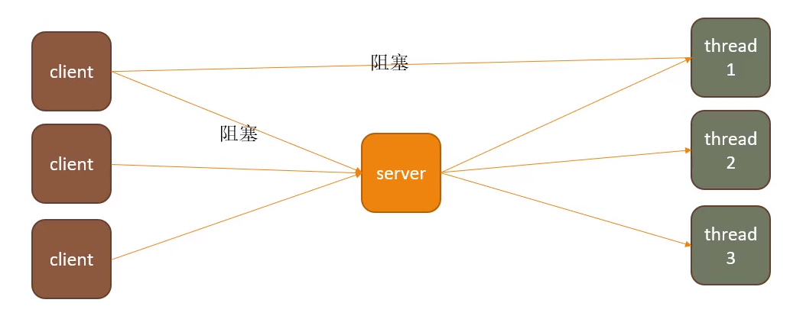
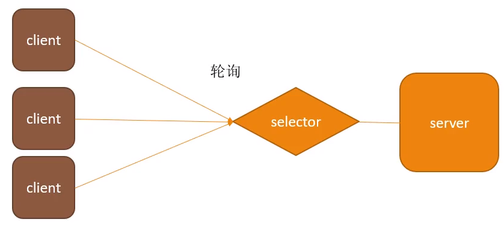
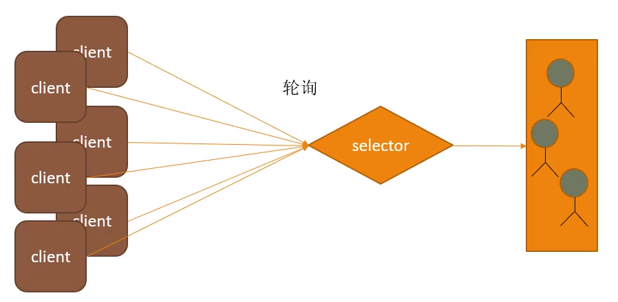
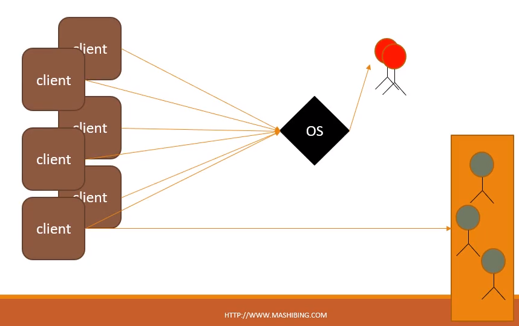

# BIO、NIO模型、代码实现

[TOC]


## 一、BIO — Blocking IO（Input - Output）阻塞IO

### 1.BIO代码

server端代码：

```java
import java.io.IOException;
import java.net.InetSocketAddress;
import java.net.ServerSocket;
import java.net.Socket;

public class Server {
    public static void main(String[] args) throws IOException {
        ServerSocket ss = new ServerSocket();
        ss.bind(new InetSocketAddress("127.0.0.1", 8888));
        while(true) {
            Socket s = ss.accept(); //阻塞方法

            new Thread(() -> {
                handle(s);
            }).start();
        }

    }

    static void handle(Socket s) {
        try {
            byte[] bytes = new byte[1024];
            int len = s.getInputStream().read(bytes);//阻塞
            System.out.println(new String(bytes, 0, len));

            s.getOutputStream().write(bytes, 0, len);//阻塞
            s.getOutputStream().flush();
        } catch (IOException e) {
            e.printStackTrace();
        }

    }
}
```


client端代码：

```java
import java.io.IOException;
import java.io.OutputStream;
import java.net.Socket;

public class Client {
    public static void main(String[] args) throws IOException {
        Socket s = new Socket("127.0.0.1", 8888);
        s.getOutputStream().write("HelloServer".getBytes());
        s.getOutputStream().flush();
        //s.getOutputStream().close();
        System.out.println("write over, waiting for msg back...");
        byte[] bytes = new byte[1024];
        int len = s.getInputStream().read(bytes);
        System.out.println(new String(bytes, 0, len));
        s.close();
    }
}

```


### 2.阻塞IO为何阻塞？在哪里阻塞？

阻塞方法：

​	accept()：只有在新的客户端连进才开始工作，除了等人，干不了其他事。

​	read()：当客户端没有给你输入流的时候阻塞。

​	write()：当你给服务端输入流的时候，它不接受，完蛋了，你又阻塞了。


### 3.BIO模型




## 二、NIO — Non-block IO（大管家式的模型）


### 1.NIO — single Thread （Nio的单线程模型）



selector处理client与server的连接请求并管理两端之间的读写


### 2.NIO单线程模式代码

```java
import java.io.IOException;
import java.net.InetSocketAddress;
import java.nio.ByteBuffer;
import java.nio.channels.SelectionKey;
import java.nio.channels.Selector;
import java.nio.channels.ServerSocketChannel;
import java.nio.channels.SocketChannel;
import java.util.Iterator;
import java.util.Set;

public class Server {
    public static void main(String[] args) throws IOException {
        ServerSocketChannel ssc = ServerSocketChannel.open();
        ssc.socket().bind(new InetSocketAddress("127.0.0.1", 8888));
        ssc.configureBlocking(false);//配置为非阻塞

        System.out.println("server started, listening on :" + ssc.getLocalAddress());
        Selector selector = Selector.open();
        ssc.register(selector, SelectionKey.OP_ACCEPT);

        while(true) {
            selector.select();
            Set<SelectionKey> keys = selector.selectedKeys();
            Iterator<SelectionKey> it = keys.iterator();
            while(it.hasNext()) {
                SelectionKey key = it.next();
                it.remove();
                handle(key);
            }
        }

    }

    private static void handle(SelectionKey key) {
        if(key.isAcceptable()) {
            try {
                ServerSocketChannel ssc = (ServerSocketChannel) key.channel();
                SocketChannel sc = ssc.accept();//bio时是Socket，nio时是SocketChannel
                sc.configureBlocking(false);
                //new Client
                //
                //String hostIP = ((InetSocketAddress)sc.getRemoteAddress()).getHostString();

			/*
			log.info("client " + hostIP + " trying  to connect");
			for(int i=0; i<clients.size(); i++) {
				String clientHostIP = clients.get(i).clientAddress.getHostString();
				if(hostIP.equals(clientHostIP)) {
					log.info("this client has already connected! is he alvie " + clients.get(i).live);
					sc.close();
					return;
				}
			}*/

                sc.register(key.selector(), SelectionKey.OP_READ );
            } catch (IOException e) {
                e.printStackTrace();
            } finally {
            }
        } else if (key.isReadable()) { //flip
            SocketChannel sc = null;
            try {
                sc = (SocketChannel)key.channel();
                ByteBuffer buffer = ByteBuffer.allocate(512);
                buffer.clear();
                int len = sc.read(buffer);

                if(len != -1) {
                    System.out.println(new String(buffer.array(), 0, len));
                }

                ByteBuffer bufferToWrite = ByteBuffer.wrap("HelloClient".getBytes());
                sc.write(bufferToWrite);
            } catch (IOException e) {
                e.printStackTrace();
            } finally {
                if(sc != null) {
                    try {
                        sc.close();
                    } catch (IOException e) {
                        e.printStackTrace();
                    }
                }
            }
        }
    }
}
```


### 3. NIO-reactor模式（reactor响应式编程）

将客户端分配给线程池（相当于一个大管家领着一帮工人）,selectoc只负责连接，工人负责读写




### 4.NIO多线程模式代码实现

```java
import java.io.ByteArrayOutputStream;
import java.io.IOException;
import java.net.InetSocketAddress;
import java.nio.ByteBuffer;
import java.nio.channels.SelectionKey;
import java.nio.channels.Selector;
import java.nio.channels.ServerSocketChannel;
import java.nio.channels.SocketChannel;
import java.util.Iterator;
import java.util.concurrent.ExecutorService;
import java.util.concurrent.Executors;

public class PoolServer {

    ExecutorService pool = Executors.newFixedThreadPool(50);

    private Selector selector;
    //中文测试

    /**
     *
     * @throws IOException
     */
    public static void main(String[] args) throws IOException {
        PoolServer server = new PoolServer();
        server.initServer(8000);
        server.listen();
    }

    /**
     *
     * @param port
     * @throws IOException
     */
    public void initServer(int port) throws IOException {
        //
        ServerSocketChannel serverChannel = ServerSocketChannel.open();
        //
        serverChannel.configureBlocking(false);
        //
        serverChannel.socket().bind(new InetSocketAddress(port));
        //
        this.selector = Selector.open();

        serverChannel.register(selector, SelectionKey.OP_ACCEPT);
        System.out.println("服务端启动成功！");
    }

    /**
     *
     * @throws IOException
     */
    @SuppressWarnings("unchecked")
    public void listen() throws IOException {
        // 轮询访问selector  
        while (true) {
            //
            selector.select();
            //
            Iterator ite = this.selector.selectedKeys().iterator();
            while (ite.hasNext()) {
                SelectionKey key = (SelectionKey) ite.next();
                //
                ite.remove();
                //
                if (key.isAcceptable()) {
                    ServerSocketChannel server = (ServerSocketChannel) key.channel();
                    //
                    SocketChannel channel = server.accept();
                    //
                    channel.configureBlocking(false);
                    //
                    channel.register(this.selector, SelectionKey.OP_READ);
                    //
                } else if (key.isReadable()) {
                    //
                    key.interestOps(key.interestOps()&(~SelectionKey.OP_READ));
                    //
                    pool.execute(new ThreadHandlerChannel(key));
                }
            }
        }
    }
}

/**
 *
 * @param
 * @throws IOException
 */
class ThreadHandlerChannel extends Thread{
    private SelectionKey key;
    ThreadHandlerChannel(SelectionKey key){
        this.key=key;
    }
    @Override
    public void run() {
        //
        SocketChannel channel = (SocketChannel) key.channel();
        //
        ByteBuffer buffer = ByteBuffer.allocate(1024);
        //
        ByteArrayOutputStream baos = new ByteArrayOutputStream();
        try {
            int size = 0;
            while ((size = channel.read(buffer)) > 0) {
                buffer.flip();
                baos.write(buffer.array(),0,size);
                buffer.clear();
            }
            baos.close();
            //
            byte[] content=baos.toByteArray();
            ByteBuffer writeBuf = ByteBuffer.allocate(content.length);
            writeBuf.put(content);
            writeBuf.flip();
            channel.write(writeBuf);//
            if(size==-1){

                channel.close();
            }else{
                //
                key.interestOps(key.interestOps()|SelectionKey.OP_READ);
                key.selector().wakeup();
            }
        }catch (Exception e) {
            System.out.println(e.getMessage());
        }
    }
}
```


## 三、AIO - 不再需要轮询（asynchronous 异步）

### 1.AIO模型

当客户端要连接的时候，交给操作系统连接，才给大管家发消息说有人要连接，你要不要处理。连上后再交给工人干活。




### 2.AIO代码实现

```java
import java.io.IOException;
import java.net.InetSocketAddress;
import java.nio.ByteBuffer;
import java.nio.channels.AsynchronousServerSocketChannel;
import java.nio.channels.AsynchronousSocketChannel;
import java.nio.channels.CompletionHandler;

public class Server {
    public static void main(String[] args) throws Exception {
        final AsynchronousServerSocketChannel serverChannel = AsynchronousServerSocketChannel.open()
                .bind(new InetSocketAddress(8888));

        serverChannel.accept(null, new CompletionHandler<AsynchronousSocketChannel, Object>() {
            @Override
            public void completed(AsynchronousSocketChannel client, Object attachment) {
                serverChannel.accept(null, this);
                try {
                    System.out.println(client.getRemoteAddress());
                    ByteBuffer buffer = ByteBuffer.allocate(1024);
                    client.read(buffer, buffer, new CompletionHandler<Integer, ByteBuffer>() {
                        @Override
                        public void completed(Integer result, ByteBuffer attachment) {
                            attachment.flip();
                            System.out.println(new String(attachment.array(), 0, result));
                            client.write(ByteBuffer.wrap("HelloClient".getBytes()));
                        }

                        @Override
                        public void failed(Throwable exc, ByteBuffer attachment) {
                            exc.printStackTrace();
                        }
                    });


                } catch (IOException e) {
                    e.printStackTrace();
                }
            }

            @Override
            public void failed(Throwable exc, Object attachment) {
                exc.printStackTrace();
            }
        });

        while (true) {
            Thread.sleep(1000);
        }

    }
}
```


## 四、Netty

Netty底层实现是用的NIO


### 代码实现

服务端

```java
import com.mashibing.io.aio.Server;
import io.netty.bootstrap.ServerBootstrap;
import io.netty.buffer.ByteBuf;
import io.netty.buffer.Unpooled;
import io.netty.channel.*;
import io.netty.channel.nio.NioEventLoopGroup;
import io.netty.channel.socket.SocketChannel;
import io.netty.channel.socket.nio.NioServerSocketChannel;
import io.netty.util.CharsetUtil;

public class HelloNetty {
    public static void main(String[] args) {
        new NettyServer(8888).serverStart();
    }
}

class NettyServer {


    int port = 8888;

    public NettyServer(int port) {
        this.port = port;
    }

    public void serverStart() {
        EventLoopGroup bossGroup = new NioEventLoopGroup();//负责连接的线程组
        EventLoopGroup workerGroup = new NioEventLoopGroup();//负责IO的线程组
        ServerBootstrap b = new ServerBootstrap();

        b.group(bossGroup, workerGroup)
                .channel(NioServerSocketChannel.class)
                .childHandler(new ChannelInitializer<SocketChannel>() {
                    @Override
                    protected void initChannel(SocketChannel ch) throws Exception {
                        ch.pipeline().addLast(new Handler());
                    }
                });

        try {
            ChannelFuture f = b.bind(port).sync();

            f.channel().closeFuture().sync();
        } catch (InterruptedException e) {
            e.printStackTrace();
        } finally {
            workerGroup.shutdownGracefully();
            bossGroup.shutdownGracefully();
        }


    }
}

class Handler extends ChannelInboundHandlerAdapter {
    @Override
    public void channelRead(ChannelHandlerContext ctx, Object msg) throws Exception {
        //super.channelRead(ctx, msg);
        System.out.println("server: channel read");
        ByteBuf buf = (ByteBuf)msg;

        System.out.println(buf.toString(CharsetUtil.UTF_8));

        ctx.writeAndFlush(msg);

        ctx.close();

        //buf.release();
    }


    @Override
    public void exceptionCaught(ChannelHandlerContext ctx, Throwable cause) throws Exception {
        //super.exceptionCaught(ctx, cause);
        cause.printStackTrace();
        ctx.close();
    }
}
```

客户端代码

```java
import io.netty.bootstrap.Bootstrap;
import io.netty.buffer.ByteBuf;
import io.netty.buffer.Unpooled;
import io.netty.channel.*;
import io.netty.channel.nio.NioEventLoopGroup;
import io.netty.channel.socket.SocketChannel;
import io.netty.channel.socket.nio.NioSocketChannel;
import io.netty.util.ReferenceCountUtil;

public class Client {
    public static void main(String[] args) {
        new Client().clientStart();
    }

    private void clientStart() {
        EventLoopGroup workers = new NioEventLoopGroup();
        Bootstrap b = new Bootstrap();
        b.group(workers)
                .channel(NioSocketChannel.class)
                .handler(new ChannelInitializer<SocketChannel>() {

                    @Override
                    protected void initChannel(SocketChannel ch) throws Exception {
                        System.out.println("channel initialized!");
                        ch.pipeline().addLast(new ClientHandler());
                    }
                });

        try {
            System.out.println("start to connect...");
            ChannelFuture f = b.connect("127.0.0.1", 8888).sync();

            f.channel().closeFuture().sync();

        } catch (InterruptedException e) {
            e.printStackTrace();

        } finally {
            workers.shutdownGracefully();
        }

    }


}

class ClientHandler extends ChannelInboundHandlerAdapter {
    @Override
    public void channelActive(ChannelHandlerContext ctx) throws Exception {
        System.out.println("channel is activated.");

        final ChannelFuture f = ctx.writeAndFlush(Unpooled.copiedBuffer("HelloNetty".getBytes()));
        f.addListener(new ChannelFutureListener() {
            @Override
            public void operationComplete(ChannelFuture future) throws Exception {
                System.out.println("msg send!");
                //ctx.close();
            }
        });


    }

    @Override
    public void channelRead(ChannelHandlerContext ctx, Object msg) throws Exception {
        try {
            ByteBuf buf = (ByteBuf)msg;
            System.out.println(buf.toString());
        } finally {
            ReferenceCountUtil.release(msg);
        }
    }
}
```

