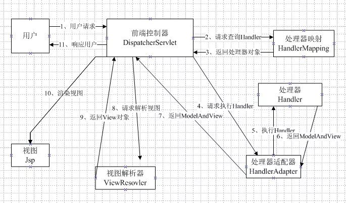
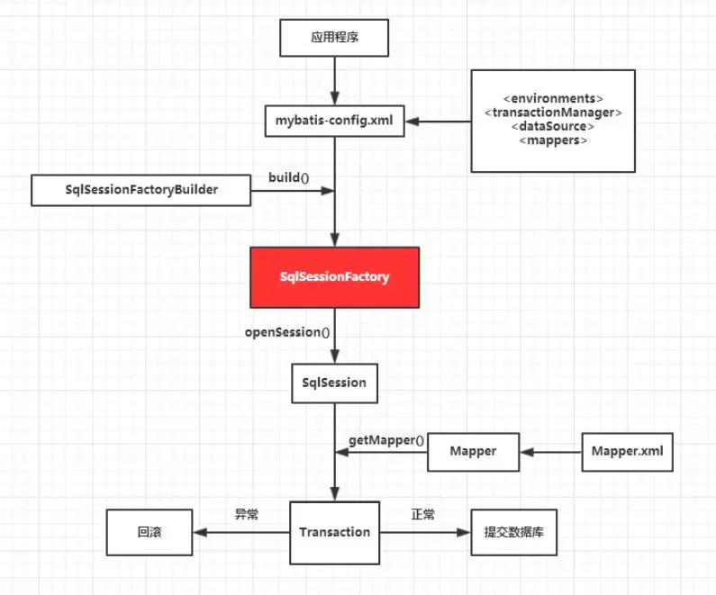

# Java SSM框架常见面试题

* [一、Spring面试题](#%E4%B8%80spring%E9%9D%A2%E8%AF%95%E9%A2%98)
  * [1、Spring在ssm中起什么作用？](#1spring%E5%9C%A8ssm%E4%B8%AD%E8%B5%B7%E4%BB%80%E4%B9%88%E4%BD%9C%E7%94%A8)
  * [2、Spring的事务？](#2spring%E7%9A%84%E4%BA%8B%E5%8A%A1)
  * [3、IOC 在项目中的作用？](#3ioc-%E5%9C%A8%E9%A1%B9%E7%9B%AE%E4%B8%AD%E7%9A%84%E4%BD%9C%E7%94%A8)
  * [4、Spring的配置文件中的内容？](#4spring%E7%9A%84%E9%85%8D%E7%BD%AE%E6%96%87%E4%BB%B6%E4%B8%AD%E7%9A%84%E5%86%85%E5%AE%B9)
  * [5、Spring下的注解？](#5spring%E4%B8%8B%E7%9A%84%E6%B3%A8%E8%A7%A3)
    * [@Autowired和@Resource的区别](#autowired%E5%92%8Cresource%E7%9A%84%E5%8C%BA%E5%88%AB)
  * [6、Spring DI 的三种方式?](#6spring-di-%E7%9A%84%E4%B8%89%E7%A7%8D%E6%96%B9%E5%BC%8F)
  * [7、Spring主要使用了什么模式？](#7spring%E4%B8%BB%E8%A6%81%E4%BD%BF%E7%94%A8%E4%BA%86%E4%BB%80%E4%B9%88%E6%A8%A1%E5%BC%8F)
* [二、SpringMVC面试题](#%E4%BA%8Cspringmvc%E9%9D%A2%E8%AF%95%E9%A2%98)
  * [1、SpringMVC 的控制器是不是单例模式，如果是，有什么问题，怎么解决？](#1springmvc-%E7%9A%84%E6%8E%A7%E5%88%B6%E5%99%A8%E6%98%AF%E4%B8%8D%E6%98%AF%E5%8D%95%E4%BE%8B%E6%A8%A1%E5%BC%8F%E5%A6%82%E6%9E%9C%E6%98%AF%E6%9C%89%E4%BB%80%E4%B9%88%E9%97%AE%E9%A2%98%E6%80%8E%E4%B9%88%E8%A7%A3%E5%86%B3)
  * [2、SpringMVC 中控制器的注解？](#2springmvc-%E4%B8%AD%E6%8E%A7%E5%88%B6%E5%99%A8%E7%9A%84%E6%B3%A8%E8%A7%A3)
  * [3、@RequestMapping 注解用在类上的作用？](#3requestmapping-%E6%B3%A8%E8%A7%A3%E7%94%A8%E5%9C%A8%E7%B1%BB%E4%B8%8A%E7%9A%84%E4%BD%9C%E7%94%A8)
  * [4、前台多个参数，这些参数都是一个对象，快速得到对象？](#4%E5%89%8D%E5%8F%B0%E5%A4%9A%E4%B8%AA%E5%8F%82%E6%95%B0%E8%BF%99%E4%BA%9B%E5%8F%82%E6%95%B0%E9%83%BD%E6%98%AF%E4%B8%80%E4%B8%AA%E5%AF%B9%E8%B1%A1%E5%BF%AB%E9%80%9F%E5%BE%97%E5%88%B0%E5%AF%B9%E8%B1%A1)
  * [5、SpringMVC中函数的返回值？](#5springmvc%E4%B8%AD%E5%87%BD%E6%95%B0%E7%9A%84%E8%BF%94%E5%9B%9E%E5%80%BC)
  * [6、SpringMVC中的转发和重定向?](#6springmvc%E4%B8%AD%E7%9A%84%E8%BD%AC%E5%8F%91%E5%92%8C%E9%87%8D%E5%AE%9A%E5%90%91)
  * [7、SpringMVC和Ajax之间的相互调用？](#7springmvc%E5%92%8Cajax%E4%B9%8B%E9%97%B4%E7%9A%84%E7%9B%B8%E4%BA%92%E8%B0%83%E7%94%A8)
  * [8、SpringMVC的工作流程图?](#8springmvc%E7%9A%84%E5%B7%A5%E4%BD%9C%E6%B5%81%E7%A8%8B%E5%9B%BE)
  * [9、Struts2 和 SpringMVC的区别?](#9struts2-%E5%92%8C-springmvc%E7%9A%84%E5%8C%BA%E5%88%AB)
    * [入口不同：](#%E5%85%A5%E5%8F%A3%E4%B8%8D%E5%90%8C)
    * [开发方式不同：](#%E5%BC%80%E5%8F%91%E6%96%B9%E5%BC%8F%E4%B8%8D%E5%90%8C)
    * [请求方式不同：](#%E8%AF%B7%E6%B1%82%E6%96%B9%E5%BC%8F%E4%B8%8D%E5%90%8C)
* [三、Mybatis面试题](#%E4%B8%89mybatis%E9%9D%A2%E8%AF%95%E9%A2%98)
  * [1、Ibatis和Mybatis？](#1ibatis%E5%92%8Cmybatis)
  * [2、什么是Mybatis的接口绑定，有什么好处？](#2%E4%BB%80%E4%B9%88%E6%98%AFmybatis%E7%9A%84%E6%8E%A5%E5%8F%A3%E7%BB%91%E5%AE%9A%E6%9C%89%E4%BB%80%E4%B9%88%E5%A5%BD%E5%A4%84)
  * [3、什么情况用注解，什么情况用xml绑定？](#3%E4%BB%80%E4%B9%88%E6%83%85%E5%86%B5%E7%94%A8%E6%B3%A8%E8%A7%A3%E4%BB%80%E4%B9%88%E6%83%85%E5%86%B5%E7%94%A8xml%E7%BB%91%E5%AE%9A)
  * [4、Mybatis在核心处理类叫什么?](#4mybatis%E5%9C%A8%E6%A0%B8%E5%BF%83%E5%A4%84%E7%90%86%E7%B1%BB%E5%8F%AB%E4%BB%80%E4%B9%88)
  * [5、查询表名和返回实体Bean对象不一致，如何处理？](#5%E6%9F%A5%E8%AF%A2%E8%A1%A8%E5%90%8D%E5%92%8C%E8%BF%94%E5%9B%9E%E5%AE%9E%E4%BD%93bean%E5%AF%B9%E8%B1%A1%E4%B8%8D%E4%B8%80%E8%87%B4%E5%A6%82%E4%BD%95%E5%A4%84%E7%90%86)
  * [6、Mybatis的好处？](#6mybatis%E7%9A%84%E5%A5%BD%E5%A4%84)
  * [7、Mybatis配置一对多？](#7mybatis%E9%85%8D%E7%BD%AE%E4%B8%80%E5%AF%B9%E5%A4%9A)
  * [8、Mybatis配置一对一？](#8mybatis%E9%85%8D%E7%BD%AE%E4%B8%80%E5%AF%B9%E4%B8%80)
  * [9 、$\{\} 和 \#\{\}的区别？](#9--%E5%92%8C-%E7%9A%84%E5%8C%BA%E5%88%AB)
      * [总结：一般用\#\{\}来进行列的代替](#%E6%80%BB%E7%BB%93%E4%B8%80%E8%88%AC%E7%94%A8%E6%9D%A5%E8%BF%9B%E8%A1%8C%E5%88%97%E7%9A%84%E4%BB%A3%E6%9B%BF)
  * [10、获取上一次自动生成的主键值？](#10%E8%8E%B7%E5%8F%96%E4%B8%8A%E4%B8%80%E6%AC%A1%E8%87%AA%E5%8A%A8%E7%94%9F%E6%88%90%E7%9A%84%E4%B8%BB%E9%94%AE%E5%80%BC)
  * [11、Mybatis如何分页，分页原理？](#11mybatis%E5%A6%82%E4%BD%95%E5%88%86%E9%A1%B5%E5%88%86%E9%A1%B5%E5%8E%9F%E7%90%86)
  * [12、Mybatis工作原理？](#12mybatis%E5%B7%A5%E4%BD%9C%E5%8E%9F%E7%90%86)
      * [原理：](#%E5%8E%9F%E7%90%86)

## 一、Spring面试题

### 1、Spring在ssm中起什么作用？

- Spring：轻量级框架
- 作用：Bean工厂，用来管理Bean的生命周期和框架集成
- 两大核心：
  1.  IOC/ DI（控制反转/依赖注入）：把dao依赖注入到service层，service层反转给action层，Spring顶层容器为BeanFactory。
  2.  AOP：面向切面编程

### 2、Spring的事务？

- 编程式事务管理：编程方式管理事务，极大灵活性，难维护。
- 声明式事务管理：可以将业务代码和事务管理分离，用注解和xml配置来管理事务。

> 编程式事务是自己写事务处理的类，然后调用;
> 声明式事务是在配置文件中配置，一般搭配在框架里面使用！

> 通常的观念认为，事务仅与数据库相关。
> 事务必须服从ISO/IEC所制定的**ACID原则**。
> ACID是原子性（atomicity）、一致性（consistency）、隔离性（isolation）和持久性（durability）的缩写。

> **原子性**表示事务执行过程中的任何失败都将导致事务所做的任何修改失效。
> **一致性**表示当事务执行失败时，所有被该事务影响的数据都应该恢复到事务执行前的状态。
> **隔离性**表示在事务执行过程中对数据的修改，在事务提交之前对其他事务不可见。
> **持久性**表示已提交的数据在事务执行失败时，数据的状态都应该正确。


### 3、IOC 在项目中的作用？

**作用：**Ioc解决对象之间的依赖问题，把所有Bean的依赖关系通过配置文件或注解关联起来，降低了耦合度。

### 4、Spring的配置文件中的内容？

- 开启事务注解驱动
- 事务管理器
- 开启注解功能，并配置扫描包
- 配置数据库
- 配置SQL会话工厂，别名，映射文件   SQL Session
- 不用编写Dao层的实现类

### 5、Spring下的注解？

- 注册：@Controller @Service @Component
- 注入：@Autowired @Resource
- 请求地址：@RequestMapping
- 返回具体数据类型而非跳转：@ResponseBody


> #### @Autowired和@Resource的区别
>
> @Autowired 这个是spring的注解　　　　org.springframework.beans.factory.annotation.Autowired
>
> @Resource 这属于java自带的注解　　  　javax.annotation.Resource
>
> @Autowired默认是按照类型来注入的，需要按名字注入的话可以跟@Qualifier搭配使用
>
> @Resource是按照里面的name属性来注入的
>
> 上代码吧，更有区分性
>
> 针对于面向接口编程的话，一个接口一个实现类是没啥区分性的。
>
> 倘若两个实现类，你不指定的话，会报这个错
>
> org.springframework.beans.factory.BeanCreationException bean创建失败
>
> expected single matching bean but found 2: personServiceImpl1,personServiceImpl2
>
> 可以写一个实例 一个service接口，两个serviceImpl实现类
>
> ```java
> public interface PersonService {public List<Person> listPerson();
> }
> ```
>
> ```java
> @Service
> public class PersonServiceImpl1 implements PersonService{
>     @Autowired
>     private PersonMapper mapper;
>
>     public List<Person> listPerson() {
>         System.out.println("PersonServiceImpl1.java");
>         return mapper.listPerson();
>     }
> }
> ```
>
> ```java
> @Service
> public class PersonServiceImpl2 implements PersonService{
>     @Autowired
>     private PersonMapper mapper;
>
>     public List<Person> listPerson() {
>         System.out.println("PersonServiceImpl2.java");
>         return mapper.listPerson();
>     }
> }
> ```
>
> 之后写一个controller层来进行注入调用
>
> ```java
> @Controller
> public class PersonController {
>     @Autowired
>     @Qualifier("personServiceImpl1")
>     private PersonService service;
>     
>     @Resource(name="personServiceImpl2")
>     private PersonService service2;
>     
>     @RequestMapping("listPerson")
>     @ResponseBody
>     public void listPerson(){
>         List<Person> list = service.listPerson();
>         System.out.println(list);
>     }
>     
>     @RequestMapping("listPerson2")
>     @ResponseBody
>     public void listPerson2(){
>         List<Person> list = service2.listPerson();
>         System.out.println(list);
>     }
> }
> ```


### 6、Spring DI 的三种方式?

构造方法注入：通过构造方法初始化

```xml
<constructor-arg index="0" type="java.lang.String" value="宝马"></constructor-arg>
```

setter方法注入：通过setter方法初始化

```xml
 <property name="id" value="1111"></property>
```

接口注入：指从别的地方注入的方式。（通过在xml中描述，实现注入）

CSDN： [依赖注入的三种方式](https://www.cnblogs.com/c-c-c-c/p/9231539.html)

### 7、Spring主要使用了什么模式？

- 工厂模式：每个Bean的创建通过方法
- 单例模式：默认的每个Bean的作用域都是单例
  - 1、单例类只能有一个实例。
  - 2、单例类必须自己创建自己的唯一实例。
  - 3、单例类必须给所有其他对象提供这一实例。
- 代理模式：关于Aop的实现通过代理模式
  - 代理（Proxy）是一种设计模式，它提供了对目标对象另外的访问方式；即通过代理访问目标对象。好处：可以在目标对象实现的基础上，增强额外的功能操作。(扩展目标对象的功能)。 


## 二、SpringMVC面试题

### 1、SpringMVC 的控制器是不是单例模式，如果是，有什么问题，怎么解决？

- 问题：单例模式，在多线程访问时有线程安全问题
- 解决方法：不要用同步，在控制器里面不能写字段

### 2、SpringMVC 中控制器的注解？

@Controller：该注解表明该类扮演控制器的角色

### 3、@RequestMapping 注解用在类上的作用？

作用：用来映射一个URL到一个类或者一个特定的处理方法上

### 4、前台多个参数，这些参数都是一个对象，快速得到对象？

方法：直接在方法中声明这个对象，SpringMvc就自动把属性赋值到这个对象里面

### 5、SpringMVC中函数的返回值？

String，ModelAndView，List，Set 等

一般String，Ajax请求，返回一个List集合

### 6、SpringMVC中的转发和重定向?

- 转发：return：“hello”
- 重定向 ：return：“redirect:hello.jsp”

### 7、SpringMVC和Ajax之间的相互调用？

通过JackSon框架把java里面对象直接转换成js可识别的json对象，具体步骤如下：

- 加入JackSon.jar
- 在配置文件中配置json的映射
- 在接受Ajax方法里面直接返回Object，list等，方法前面需要加上注解@ResponseBody


### 8、SpringMVC的工作流程图?



### 9、Struts2 和 SpringMVC的区别?

#### 入口不同：

- Struts2：filter过滤器
- SpringMvc：一个Servlet即前端控制器

#### 开发方式不同：

- Struts2：基于类开发，传递参数通过类的属性，只能设置为多例
- SpringMvc：基于方法开发(一个url对应一个方法)，请求参数传递到方法形参，可以为单例也可以为多例(建议单例)

#### 请求方式不同：

- Struts2：值栈村塾请求和响应的数据，通过OGNL存取数据
- SpringMVC：通过参数解析器将request请求内容解析，给方法形参赋值，将数据和视图封装成ModelAndView对象，最后又将ModelAndView中的模型数据通过request域传输到页面，jsp视图解析器默认使用的是jstl。


## 三、Mybatis面试题

### 1、Ibatis和Mybatis？

- Ibatis：2010年，apache的Ibatis框架停止更新，并移交给了google团队，同时更名为MyBatis。从2010年后Ibatis在没更新过，彻底变成了一个孤儿框架。一个没人维护的框架注定被mybatis拍在沙滩上。
- Mybatis：Ibatis的升级版本。

### 2、什么是Mybatis的接口绑定，有什么好处？

Mybatis实现了DAO接口与xml映射文件的绑定，自动为我们生成接口的具体实现，使用起来变得更加省事和方便。

### 3、什么情况用注解，什么情况用xml绑定？

- 注解使用情况：Sql语句简单时
- xml绑定使用情况：xml绑定 (@RequestMap用来绑定xml文件)

### 4、Mybatis在核心处理类叫什么?

SqlSession

### 5、查询表名和返回实体Bean对象不一致，如何处理？

映射键值对即可

```xml
<result column="title" property="title" javaType="java.lang.String"/>
```

- column：数据库中表的列名
- property：实体Bean中的属性名

### 6、Mybatis的好处？

- 把Sql语句从Java中独立出来。
- 封装了底层的JDBC，API的调用，并且能够将结果集**自动转换成JavaBean对象**，简化了Java数据库编程的重复工作。
- 自己编写Sql语句，更加的灵活。
- 入参无需用对象封装（或者map封装）,使用@Param注解

### 7、Mybatis配置一对多？

```xml
<collection property="topicComment" column="id" ofType="com.tmf.bbs.pojo.Comment" select="selectComment" />
```

- property：属性名
- column：共同列
- ofType：集合中元素的类型
- select：要连接的查询

### 8、Mybatis配置一对一？

```xml
<association property="topicType" select="selectType" column="topics_type_id" javaType="com.tmf.bbs.pojo.Type"/>
```

- property：属性名
- select：要连接的查询
- column：共同列
- javaType：集合中元素的类型

### 9 、${} 和 #{}的区别？

- \${}：简单字符串替换，把\${}直接替换成变量的值，不做任何转换，这种是取值以后再去编译SQL语句。
- \#{}：预编译处理，sql中的#{}替换成？，补全预编译语句，有效的防止Sql语句注入，这种取值是编译好SQL语句再取值。

##### 总结：一般用#{}来进行列的代替

### 10、获取上一次自动生成的主键值？

```xml
select last _insert_id()
```

### 11、Mybatis如何分页，分页原理？

- RowBounds对象分页
- 在Sql内直接书写，带有物理分页

### 12、Mybatis工作原理？



##### 原理：

- 通过SqlSessionFactoryBuilder从mybatis-config.xml配置文件中构建出SqlSessionFactory。
- SqlSessionFactory开启一个SqlSession，通过SqlSession实例获得Mapper对象并且运行Mapper映射的Sql语句。
- 完成数据库的CRUD操作和事务提交，关闭SqlSession。


