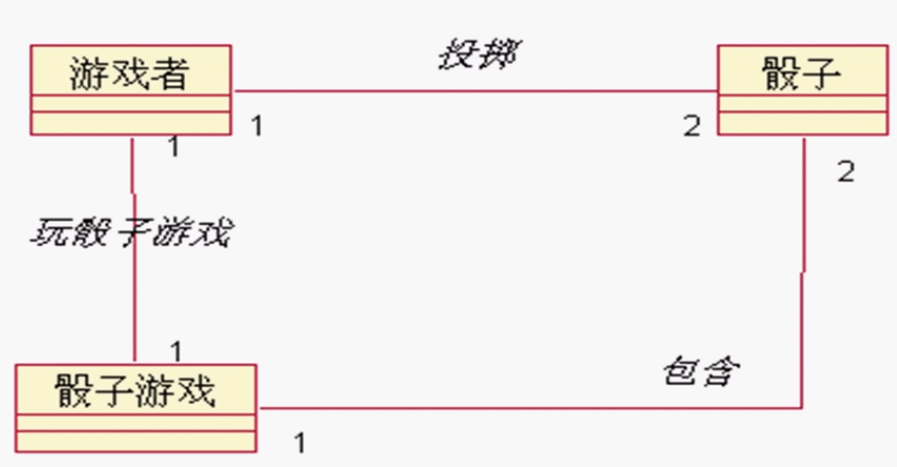
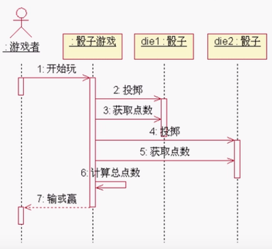
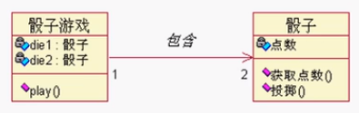
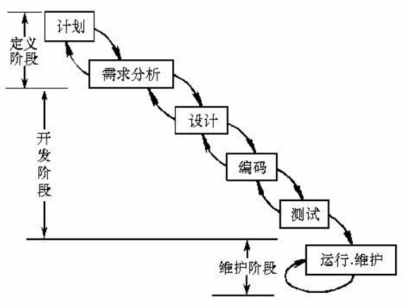
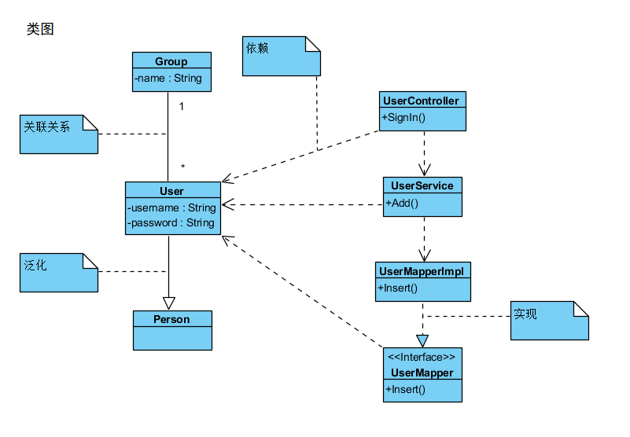
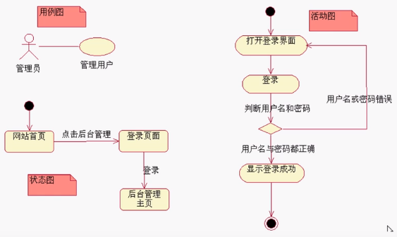
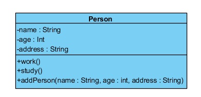
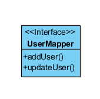
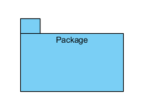
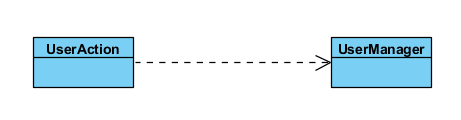

OOAD面向对象分析和设计、UML统一建模语言

[TOC]

1. 面向对象分析和设计（OOA/D）
2. UP过程与“瀑布”模型
3. UML概览
4. 需求分析与用例（用例图）
5. 类图
6. 领域模型（分析模型）
7. 交互图（顺序图和协作图）
8. UML活动图
9. UML状态图
10. GRASP与GOF（设计模型）

> 什么是建模？
>
> 建模就是给现实世界里的事物建立一种能够被人理解的模型。对现实世界的基于某种属性的统一描述。

## 面向对象分析和设计（OOA/D）

- UML不是OOA/D，也不是方法，它只是一种图形表示法
- 如果不掌握对象思想，那么UML或任何case工具（如ROSE）将毫无意义
- 我们需要一种用于OOA/D的语言，这既是一种思考的工具，也是一种沟通的形式。因此，我们将在OOA/D中引用UML。
- 分析（analysis）：对问题和需求的查询研究
- 设计（design）：满足需求的概念上的解决方案
- 面向对象分析OOA（object-oriented analysis）：在问题域内发现和描述对象
- 面向对象设计OOD（object-oriented design）：如何定义软件对象以及他们之间如何协作以实现需求

> 快速开始的示例
>
> - 骰子游戏：软件模拟游戏者投掷两个骰子，如果总点数是7则赢得游戏，否则为输
> - 过程：定义用例--》定义领域模型--》定义交互图--》定义设计类图
> - 定义过程（用例是需求分析的一种工具，它是一些情节的描述）
>   - 骰子游戏：
>     - 1.游戏者请求骰子
>     - 2.系统展示结果：如果总点数是7则游戏者赢得游戏，否则为输
> - 定义领域模型（OOA）：识别问题中的<u>概念</u>，它是对真实世界领域中的概念和想象可视化，与具体实现的软件技术无关
>   - 游戏者
>   - 骰子
>   - 骰子游戏
> - 领域模型 OOA
>   - 
> - 分配对象职责并绘制交互图（动态建模）OOD：关注的是软件对象的定义 - 职责与协作
>   - 
> - 定义设计类图（静态建模）：定义软件类、属性、方法等
>   - 

## 什么是UML？

- 标志定义：统一建模语言（Unified Modeling Language）是描述、构造和文档化系统制品的可视化语言
- UML是一个庞大的图形化表示法体系
- 应用UML的三种方式
  - 草图
  - 蓝图
  - 编程语言
- 学习UML的要素
  - 表示法 - 图形
  - 过程UP - （UML与过程无关，但最好用于RUP）
  - 工具 - （比如：Rational Rose）

## UP与瀑布模型

- 什么是UP？
  - 软件开发过程（software development process）描述了构造、部署以及维护软件的方式。统一过程（The Unified Software Development Process）是一种流行的构造面向对象系统的迭代软件开发过程。特别是，Rational统一过程（Rational Unified Process，RUP）是对统一过程的详细精化，并且已经被广泛采纳。
- UP也可以引进其他方法中的有用的实践，比如极限编程（Extreme Programming，XP）。XP中的测试驱动开发（test-driven development）、重构（refactoring）和持续集成（continuous integration）等。
- 什么是瀑布模型？
  - 试图在编程之前（详细）定义所有或大部分需求
  - 并且通常于编程之前创建出完整的设计
  - 试图在开始前定义“可靠的”计划或时间
  - 

## UML概述

- UML包括：
  - 事物
  - 关系
  - 图
  - 扩展机制
- 事务
  - 结构：类、接口、构件（软件的一个模块）、节点（部署结构：数据库节点、服务器节点）等
  - 行为：交互（消息）、状态等
  - 分组：包、子系统等等
  - 注释
- 关系
  - 依赖、关联（组合、聚合）、泛化、实现
- 图
  - 用例图、交互图（顺序图、协作图）、类图、活动图、状态图等
- 扩展机制：Stereotype、Tagged Value、Constraint

## 图的分类

- 静态建模
  - 类图
- 动态建模
  - 顺序图（协作图）
  - 用例图
  - 活动图
  - 状态图
- 学习的顺序是：
  - 从最终要的部分开始
  - 类图--》顺序图--》用例图--》活动图--》状态图

## UML类图

- 类图允许我们去标记静态内容及类之间的关系
  - 类的基本表示法
    - 名称
    - 属性（类型，可见性）
    - 方法（参数，返回值）
    - 
  - 接口的基本表示法
    - 
  - 包
    - 
  - 关系
    - 依赖（一个事务的变化影响另一个事物）
      - 
    - 关联（关联名、导航、角色、多重性、聚合、组合）
    - 泛化（extends）
    - 实现（implements）

