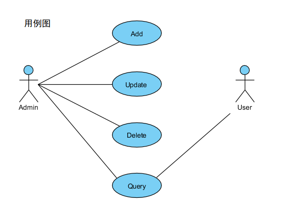
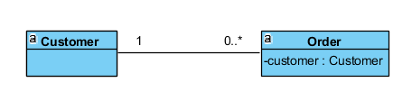
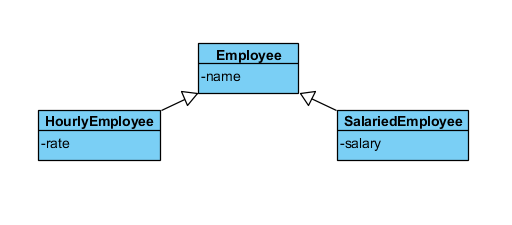
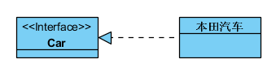
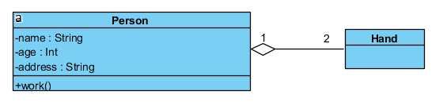
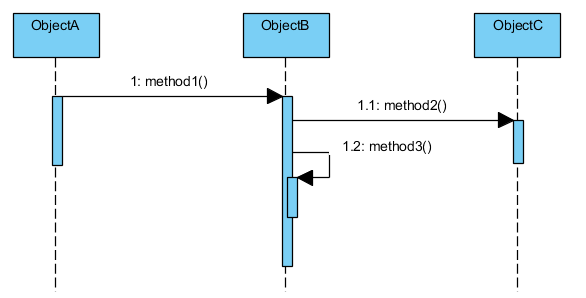

# OOAD和UML

* [面向对象分析和设计（OOAD）](#%E9%9D%A2%E5%90%91%E5%AF%B9%E8%B1%A1%E5%88%86%E6%9E%90%E5%92%8C%E8%AE%BE%E8%AE%A1ooad)
* [OOP的主要特征](#oop%E7%9A%84%E4%B8%BB%E8%A6%81%E7%89%B9%E5%BE%81)
* [UML概述](#uml%E6%A6%82%E8%BF%B0)
* [图的分类](#%E5%9B%BE%E7%9A%84%E5%88%86%E7%B1%BB)
* [用例图](#%E7%94%A8%E4%BE%8B%E5%9B%BE)
* [类图](#%E7%B1%BB%E5%9B%BE)
* [时序图](#%E6%97%B6%E5%BA%8F%E5%9B%BE)

> 什么是建模？
>
> 建模就是给现实世界里的事物建立一种能够被人理解的模型。对现实世界的基于某种属性的统一描述。

## 面向对象分析和设计（OOAD）

- UML不是OOAD，也不是方法，它只是一种图形表示法
- 如果不掌握对象思想，那么UML或任何case工具（如ROSE）将毫无意义
- 我们需要一种用于OOAD的语言，这既是一种思考的工具，也是一种沟通的形式。因此，我们将在OOAD中引用UML。
- 面向对象分析OOA（object-oriented analysis）：在问题域内发现和描述对象
- 面向对象设计OOD（object-oriented design）：如何定义软件对象以及他们之间如何协作以实现需求

## OOP的主要特征

- 抽象
  - 忽略掉一个对象或实体的细节而只关注其本质特征的过程
  - 简化功能与格式
  - 帮助用户与对象交互
- 封装
  - 隐藏数据和实现
  - 提供公用方法供用户调用功能
  - 对象的两种视图
    - 外部视图：对象能做的工作
    - 内部视图：对象如何完成工作
- 继承
  - 通过存在的类型定义新类型的机制
  - 继承可以实现代码复用，也是多态的基础
  - 苹果 “is a” 水果
- 多态
  - 一个名词，多种形态
  - 基于继承
  - 调用方法时根据所给对象的不同选择不同的护理方式
  - 如Football()-->plan()用脚完成;Basketball-->play()用手完成
- 关联
  - 对象之间交互时的一种引用方式
  - 当一个对象通过另一个对象的引用去使用另一个对象的服务或操作时，两个对象便产生了关联
- 聚合
  - 关联关系的一种，一个对象成为另一个对象的组成部分
  - 是一种关系较强的关联
- 组合
  - 当一个对象包含另一个对象时，外部对象负责管理内部对象的生命周期的情况
  - 关联关系中最强烈的一种
  - 内部对象的创建由外部对象自己控制
  - 外部对象不存在时，内部对象也不能存在
  - 如电视机与显示器
  - （组合和聚合的区别因人判断而异）
- 域模型（设计模式）
  - 域模型是面向对象的。也称为设计模式。
  - 有以下内容组成：
    - 具有状态和行为的域对象
    - 域对象之间的关系
      - 关联
      - 依赖
      - 聚集
      - 泛化（一般化）
- 内聚与耦合
  - 内聚：度量一个类独立完成某项工作的能力
  - 耦合：度量系统内或系统之间依赖关系的复杂度
  - 设计原则：低耦合高内聚

## UML概述

- 统一建模语言（Unified Modeling Language）是描述、构造和文档化系统制品的可视化语言
- 九种基本图形，常用三种：用例图、类图、时序图

## 图的分类

- 静态建模

  - *用例图 User Case Diagrams
  - *类图 Class Case Diagrams
  - 对象图、组件图、部署图（用得少）

- 动态建模
  - *时序图 Sequence DIagrams
  - 协作图、状态图、活动图（用得少）
  - 用例图
  - 活动图
  - 状态图

  ​

## 用例图

## 类图

- 类图允许我们去标记静态内容及类之间的关系
  - 类的基本表示法
    - 名称
    - 属性（类型，可见性）
    - 方法（参数，返回值）
    - 
  - 接口的基本表示法
    - 
  - 包
    - 
  - 关系
    - 依赖（一个事务的变化影响另一个事物）
      - 

    - 关联（关联名、导航、角色、多重性、聚合、组合）

      - 

    - 泛化（extends）

      - 

    - 实现（implements）

      - 

    - 聚集

      - 

      ​

## 时序图

- 捕捉一段时间范围内多个对象之间的交互信息
- 强调消息交互的时间顺序

> ObjectA调用ObjectB的method1()，ObjectB调用ObjectC的method2()，ObjectC调用自身方法method3()

参考链接：[OOAD与UML笔记](http://www.uml.org.cn/oobject/201105105.asp)

