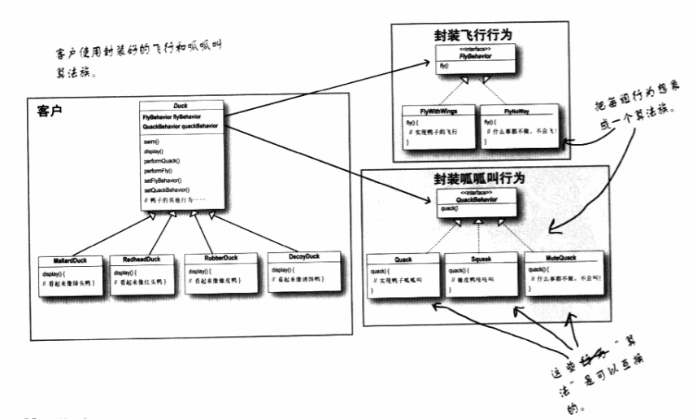

①设计模式原则

## 一、封装变化

找出应用中可能需要变化之处，把他们独立出来，不要和那些不需要变化的代码混在一起。

>   “把会变化的部分取出来并封装起来，以后便可轻易地改动或扩充此部分，而不影响不需要变化的部分”。

## 二、多用组合，少用继承

使用组合建立的系统具有很大的弹性，不仅可将算法族封装成类，更可以“在运行时动态地改变行为”，只要组合的行为对象符合正确的接口标准即可。

>   在书本第一章当中，将鸭子的行为“fly”和“quack”作为接口并组合在鸭子的超级类中。这样在实现某一种鸭子的时候同时也实现了该鸭所具有的行为类型实现。所谓“封装行为的大局观”。

## 三、针对接口编程，不针对实现编程

针对接口编程 的真正含义是 <u>针对超类型</u>（supertype）编程。

>   类似上图的设计，可以让飞行和呱呱叫的动作被其他对象复用，因为这些行为已经与鸭子类无关了。
>
>   而我们可以新增一些行为，不会影响到既有的行为类，也不会影响“使用”到飞行行为的鸭子类。

## 四、松耦合设计

为了交互对象之间的松耦合设计而努力。松耦合的设计之所以能让我们建立有弹性的OO系统，能够应对变化，是因为对象之间的互相依赖降到了最低。

## 五、开放-关闭原则

类应该对扩展开放，对修改关闭。

我们的目标是允许类容易扩展，在不修改现有代码的情况下，就可搭配新的行为。这样的设计具有弹性可以应对改变，可以接受新的功能来应对改变的需求。