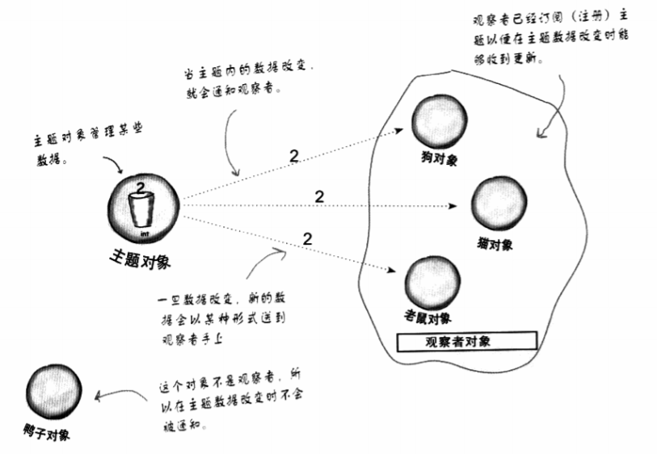
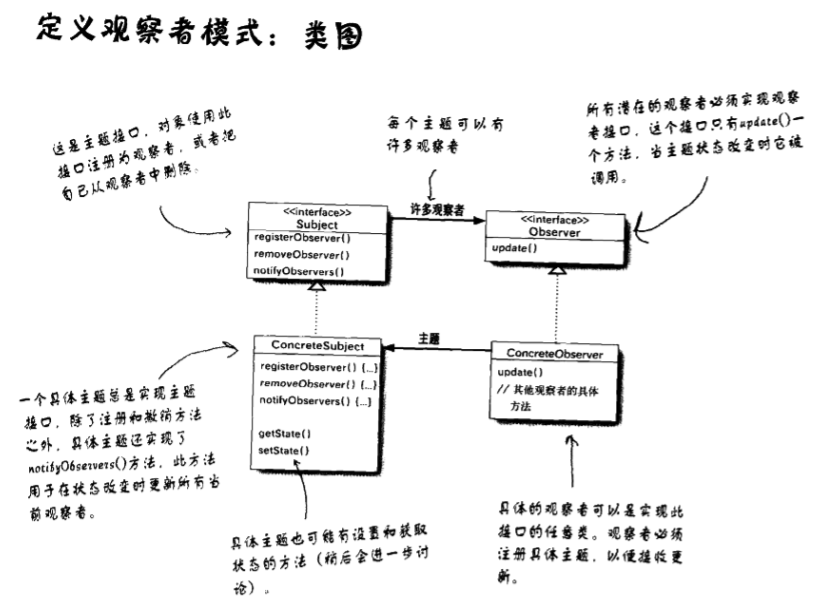
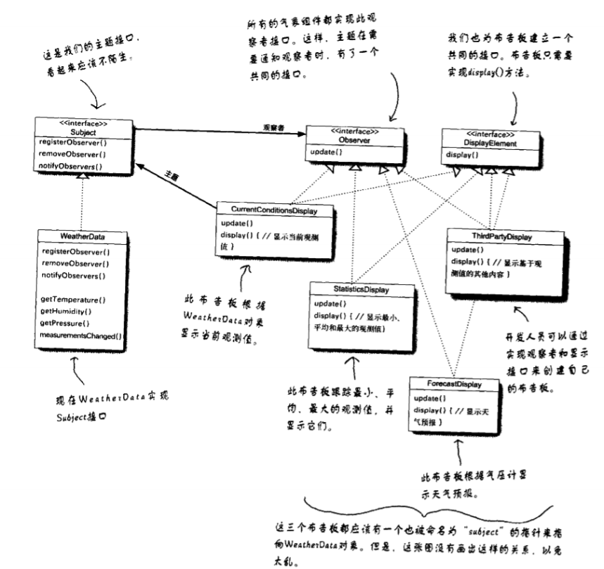

# ③观察者模式

定义了对象之间的一对多依赖，当一个对象改变状态时，它的所有依赖者都会受到通知并自动更新。

>   大白话就是，让每个观察者中持有<u>同一个</u>出版者对象并让出版者将所有观察者添加到一个集合里，当出版者对象中的属性发生变化时执行update()，观察者就能及时发现。

出版者(主题对象)+订阅者(观察者对象)=观察者模式




例子：天气预报与气象布告板





```java
//启动气象站
public class WeatherStation{
  public static void main(String[] args){
    WeatherData wd = new WeatherData();
    
    //建立三个布告板对象并把WeatherData传给他们
    CurrentConditionsDisplay ccd = new CurrentConditionsDisplay(wd);
    StatisticsDisplay sd = new StatisticsDisplay(wd);
    ForecastDisply fd = new ForecastDisply(wd);
    
    //模拟新数据测量
    wd.setMeasurements(80,65,30.4f);
  }
}
```

```java
//实现气象站
public interface Subject{
  public void registerObserver(Observer o);
  public void removeObserver(Observer o);
  public void notifyObservers();//当主题状态改变时，这个方法会被调用，以通知所有的观察者
}
//观察者
public interface Observer{
  public void update(float temp,float humidity,float pressure);
}
//布告板
public interface DisplayElement{
  public void display();
}
```

```java
//实现WeatherData类
public class WeatherData implements Subject{
  private ArrayList observers;//订阅者
  private float temperature;
  private float humidity;
  private float pressure;
  
  public WeatherData(){
    observers = new ArrayList();
  }
  
  public void registerObserver(Observer o){
    observers.add(o);
  }
  
  public void removeObserver(Observer o){
    int i = observers.indexOf(o);
    if(i>=0){
      observers.remove(i);
    }
  }
  
  public void notifyObservers(){
    for(int i = 0; i < observers.size(); i++){
      observers.update(temperature,humidity,pressure);
    }
  }
  
  public void measurementsChanged(){
    notifyObservers();
  }
  
  public void setMeasurements(float temperature, float humidity, float pressure){
    this.temperature = temperature;
    this.humidity = humidity;
    this.pressure = pressure;
    measurementsChanged();
  }
  
  //WeatherData的其他方法
}
```

```java
//实现布告板类
public class CurrentConditionDisplay implements Observer,DisplayElement {
  private float temperature;
  private float humidity;
  private Subject weatherData;//观察者
  
  public CurrentConditionsDisplay(Subject weatherData){
    this.temperature = temperature;
    weatherData.registerObserver(this);
  }
  
  public void update(float temp,float humidity,float pressure){
    this.temperature = temperature;
    this.humidity = humidity;
    display();
  }
  
  public void display(){
    System.out.println("Current conditions:"+ temperature 
                       + "F degrees and" + humidity + "% humidity");
  }
  
}
```

