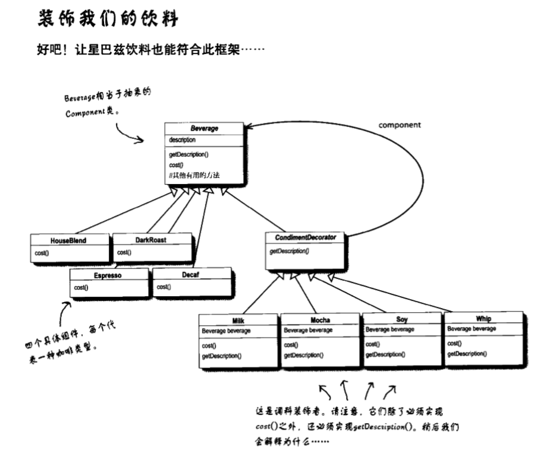

# ④装饰者模式

装饰者模式动态地将责任附加到对象上。若要扩展功能，装饰者提供了比继承更有弹性的替代方案。

>   大白话就是，装饰者和被装饰者都属于一个超类型，用装饰过的类型替代原有的类型。

-   装饰者和被装饰对象有相同的超类型
-   你可以用一个或多个装饰者包装一个对象
-   既然装饰者和被装饰对象有相同的超类型，所以在任何需要原始对象（被包装的）的场合，可以用装饰过的对象代替它。
-   <u>装饰者可以在所委托被装饰着的行为之前与/或之后，加上自己的行为，以达到特定的目的。</u>（关键点）
-   对象可以在任何时候被装饰，所以可以在运行时动态地、不限量地用你喜欢的装饰者来装饰对象。




```java
//超类型Beverage（饮料）
public abstract class Beverage{
  String description = "Unknown Beverage"；
  
  //getDescription()已经在此实现了，但是cost()必须在子类中实现
  public String getDescription(){
    return description;
  }
  
  public abstract double cost();
}
//Condiment（调料）
//必须让CondimentDeorator继承于Beverage
public abstract class CondimentDeorator extends Beverage{
  public abstract String getDescription();
}
```

```java
//写饮料的代码
public class Espresso extends Beverage{
  public Espresso(){
    description = "Espresso";
  }
  public double cost(){
    return 1.99;
  }
}
//写调料代码
public class Mocha extends CondimentDeorator{
  Beverage beverage;
  
  public Mocha(Beverage beverage){
    this.beverage = beverage;
  }
  
  public String getDescription(){
    return beverage.getDescription + ", Mocha";
  }
  
  public double cost(){
    return .20 + beverage.cost();
  }
}
```

```java
//测试代码
public class StarbuzzCoffee{
  
  public static void main(String args[]){
    Beverage beverage = new Espresso();
    Systemm.out.println(beverage.getDescription() + " $" + beverage.cost());
    
    beverage = new Mocha(beverage);
    beverage = new Mocha(beverage);
    Systemm.out.println(beverage.getDescription() + " $" + beverage.cost());
    //输出 Espresso, Mocha, Mocha, Whip $2.39
    
  }
}
```


