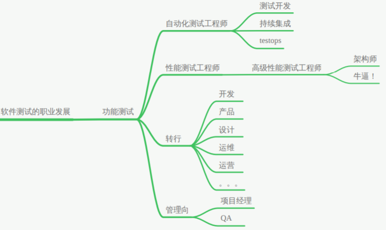

# 软件测试

* [什么是软件测试？](#%E4%BB%80%E4%B9%88%E6%98%AF%E8%BD%AF%E4%BB%B6%E6%B5%8B%E8%AF%95)
* [软件测试的职业发展](#%E8%BD%AF%E4%BB%B6%E6%B5%8B%E8%AF%95%E7%9A%84%E8%81%8C%E4%B8%9A%E5%8F%91%E5%B1%95)
* [软件测试分类](#%E8%BD%AF%E4%BB%B6%E6%B5%8B%E8%AF%95%E5%88%86%E7%B1%BB)
* [测试流程](#%E6%B5%8B%E8%AF%95%E6%B5%81%E7%A8%8B)
* [测试用例](#%E6%B5%8B%E8%AF%95%E7%94%A8%E4%BE%8B)
* [BUG管理](#bug%E7%AE%A1%E7%90%86)

## 什么是软件测试？

> “软件测试（英语：Software Testing），描述一种用来促进鉴定软件的正确性、完整性、安全性和质量的过程。换句话说，软件测试是一种实际输出与预期输出之间的审核或者比较过程。软件测试的经典定义是：在规定的条件下对程序进行操作，以发现程序错误，衡量软件质量，并对其是否能满足设计要求进行评估的过程。”
>
> ——百度百科

## 软件测试的职业发展

> testops：测试运维

## 软件测试分类

1. 按方法分：
   1. 黑盒测试：只看程序的输入和输出
   2. 白盒测试
   3. 灰盒测试：以上两种方法结合
2. 按方向分
   1. 功能测试
   2. 性能测试
      1. 压力测试：发现软件的性能瓶颈（峰值）
      2. 负载测试：测试软件的负载量
      3. 并发测试：测试多线程情况下，软件出错的情况
   3. 安全测试
3. 按阶段分
   1. 单元测试：方法、函数、类
   2. 集成测试：接口
   3. 系统测试：功能、安全、性能、兼容性、易用性、稳定性、UI、……
   4. 验收测试（由客户、老板测试）
4. 按对象分
   1. APP测试
   2. WEB测试
   3. 物联网
   4. 小程序
   5. ……
5. 按状态分
   1. 静态测试：不运行（白盒测试）
   2. 动态测试：运行（黑灰盒测试）
6. 其他
   1. 冒烟测试：测试前的测试。检查软件是否具备可测试性。如果大都打不开，就不具备可测试性。
   2. 回归测试：看开发有没有把BUG修好
   3. α测试：内测
   4. β测试：外侧

## 测试流程

1. 需求分析阶段

   1. 需求分析：需求分析、产品原型、口述
   2. 学习业务流程
   3. 提取功能点
   4. 编写需求分析说明书

2. 测试设计阶段（5W1H）

   1. 测试计划
   2. 测试方案
   3. 测试策略
   4. 测试用例

   > 5W1H: what where when who why how

3. 测试执行阶段

   1. 提交Bug
   2. 回归测试

4. 测试总结阶段

## 测试用例

1. 测试方法
   1. 等价值法※
   2. 边界值法※
   3. 场景法※
   4. 因果法
   5. 判定表
   6. 路径覆盖法

## BUG管理

1. BUG管理平台、系统、工具
   1. 禅道
   2. BUGFree
   3. testlink
   4. Bugzilla
   5. JIRA
   6. ……
2. BUG的六要素
   1. 编号
   2. BUG的名称：言简意赅，看到题目就知道是什么问题
   3. BUG的优先级：根据实际的情况，这个BUG需要优先解决吗？高/中/低
   4. BUG的登记
      1. 致命的
         1. 影响产品的和兴流程的正常使用
         2. 导致软件挂了、闪退、奔溃
         3. 和钱有关
      2. 严重的：导致功能无法正常使用
      3. 一般的：功能的某些异常场景有问题
      4. 轻微的：建议性的东西，用户体验的，UI上的问题
   5. BUG的复现步骤
      1. 可以把用例的步骤复制过来
      2. 预期结果
      3. 实际结果
   6. 附件
      1. 截图/日志/视频
      2. 目的是为BUG佐证
3. BUG的生命周期
4. BUG的状态
   1. 新建
   2. 打开/激活
   3. 已确认
   4. 已解决
   5. 拒绝
   6. 重新打开
   7. 关闭
   8. 延期处理
   9. 重复BUG