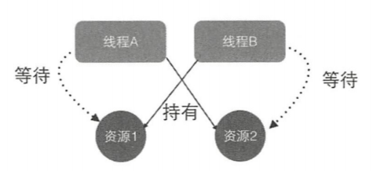

# 《Java并发编程之美》

霍陆续 薛宾田 著


目录
------

* [一、Java并发编程基础篇](#一、Java并发编程基础篇)
  * 1.什么是线程？
  * 2.线程的创建、运行、通知与等待
  * 3.线程常用方法 join() 、sleep() 、yield()
  * 4.线程中断
  * 5.上线文切换
  * 6.线程死锁
  * 7.守护线程和用户线程
  * 7.线程本地变量ThreadLocal
* [二、Java并发编程高级篇](#J二、ava并发编程高级篇)
* [三、Java并发编程实战篇](#三、Java并发编程实战篇)


一、Java并发编程基础篇
------

### 1.什么是线程？

​	进程就是代码在数据集合上的一次运行活动，是系统进行资源分配和调度的基本单位，线程则是进程的一个执行路径，一个进程至少有一个进程，进程中的多个线程共享进程资源。

进程和线程的内存关系如下图：


​	一个进程有多个线程，多个线程共享进程的堆和方法区资源，但是每个线程都有自己的程序计数器和栈区域。每个内存区的功能详情如下：

- 堆：堆是一个进程中最大的一块内存。用于存放使用new方法创建的实例对象。线程共享。

- 方法区：存放JVM加载的类、常量及静态变量等信息。线程共享。

- 程序计数器：用来记录线程当前要执行的指令地址。线程私有。

- 栈：存储线程的局部变量。线程私有。

  ​

### 2.线程的创建、运行、通知与等待

#### ①.线程的三种创建、运行方法

​	Java中有三种线程创建方法，分别为：

1. 继承Thread类并重写run方法；

2. 使用RunableTask方式——实现Runnable接口的run方法；

3. 使用FutureTask方式——实现Callable接口的call()方法；


代码实现：

```java
//继承Thread类并重写run方法
//该创建方法的好处在于：在run()方法内获取当前线程直接使用this就可以了，无需使用Thread.currentThread()方法
//不好的地方在于：Java不支持多继承；任务与代码没有分离，当多个线程执行一样的任务是需要多份任务代码。（？？任务代码分离这里好像没怎么理解）没有返回值。
public class ThreadTest {
	
  //继承Thread类并重写run方法
  public static class MyThrad extends Thread{
    
    @Override
    public void run(){
      System.out.println("I am a child thread");
    }
  }
  
  public static void main(String[] args){
    
    //创建线程
    MyThrad thread = new MyThread();
    
    //启动线程
    thread.start();
  }
}
```

```java
//使用RunableTask方式
//优点：两个线程公用一个task代码逻辑，如果需要，可以给RunnableTask添加参数进行任务区分。
//缺点：没有返回值。
public class ThreadTest {
  public static class RunnableTask implements Runnable{
  
  	@Override
  	public void run(){
    	System.out.println("I am a child thread");
  	}
  
	}
  
  public static void main(String[] args) throws InterruptedException{
    RunnableTask task = new RunnableTask();
    new Thread(task).start();
    new Thread(task).start();
  } 
}
```

```java
//使用FutureTask方式
public class ThreadTest {
  public static class CallerTask implements Callable<String>{
    
    @Override
    public String call() throws Exception{
      
      return "hello world";
    }
  }
  
  public static void main(String[] args) throws InterruptedException{
    //创建异步任务
    FutureTask<String> futureTask = new FutureTask<>(new CallerTask());
    //启动线程
    new Thread(futureTask).start();
    try {
		//等待任务执行完毕，并返回结果
      	String result = futureTask.get();
      	System.out.println(result);
    } catch (ExecutionException e) {
      e.printStackTrace();
    }
  }
}
```


三种方式的优缺点：

|            | 优点                                       | 缺点                       |
| ---------- | ---------------------------------------- | ------------------------ |
| Thread     | 直接使用this就可以在run()方法内获取获取当前线程,无需使用Thread.currentThread()方法。 | 无法再继承其他类。任务与代码没有分离。无返回值。 |
| Runnable   | 多个线程可以共用一个task代码逻辑，可以给RunnableTask添加参数进行任务区分。 | 无返回值。                    |
| FutrueTask | 有返回值。                                    |                          |


#### ②.线程的通知与等待

​	Java中的Object类是所有类的父类，并且把所有类都需要的方法放到了Object类里面，其中就包含线程的通知与等待系列函数。

​	在调用wait系列方法之前需要先获取该对象的监视器所，否则会抛出IllegalMonitorStateException异常。

​	一个线程如何才能获取一个共享变量的监视器呢？

1. 执行sychronized同步代码块，使用该共享变量作为参数。

   ```java
   synchronized(共享变量){
     //doSomething
     //共享变量.wait();
   }
   ```

2. 调用该共享变量的方法，并且该方法使用了sychronized修饰。

   ```java
   synchronized void add(int a, int b){
     //doSomething
     //a.wait();
     //b.notify();
   }
   ```

| 方法名                | 作用                                       |
| ------------------ | ---------------------------------------- |
| wait()             | 当一个线程调用一个共享变量的wait()方法时，该调用线程会被阻塞挂起，直到发生以下几个事情之一才返回：（1）其他线程调用了该共享对象的notify()或者notifyAll()方法；（2）其他线程调用了该线程的interrupt()方法。 |
| wait(long timeout) | 超时返回timeout：如果在timeout时间内没有被notify()或notifyAll()方法唤醒的话，会直接返回。 |
| notify()           | 一个线程调用共享对象的notify()方法后，会唤醒一个在该共享变量上调用wait系列方法后被挂起的线程。一个共享变量上可能会有多个线程在等待，具体唤醒哪个等待的线程是随机的。 |
| notifyAll()        | 会唤醒所有在该共享变量上由于调用wait系列方法而被挂起的线程。         |


### 3.线程常用方法 join() 、sleep() 、yield()

| 方法名     | 作用                                       |
| ------- | ---------------------------------------- |
| join()  | join是无参的void方法。join方法是由Thread类提供的，用于需要等待线程执行终止。例如：多个线程加载资源，需要等待多个线程全部加载完毕在汇总处理。 |
| sleep() | Thread中的静态方法，当一个执行中的线程调用了sleep方法，调用线程会展示让出指定时间的执行权，但是该线程的所有监视器资源（锁）还是持有不出让的。 |
| yield() | Thread中的静态方法，当一个线程执行该方法是，实际上就是暗示线程调度器当前线程请求让出自己的CPU使用。 |


### 4.线程中断

​	Java中的线程中断是一种线程间的协作我是，通过设置线程的中断标志并不能直接终止该线程，而是被中断的线程根据<u>中断状态</u>自行处理。

- void interrupt()方法：中断线程，例如：当线程A运行时，线程B可以调用线程A的interrupt()方法来设置线程A的中断标志为true并立即返回。设置标志仅仅是设置标志，线程A实际并没有被中断，它往往会继续往下执行。如果线程A因为调用了wait系列函数、join方法或sleep方法而被阻塞挂起，这时候若线程B调用线程A的interrupt()方法，线程A会在调用这些方法的地方清除中断标志并抛出InterruptedException异常而返回。

```java
public class InterruptService implements Runnable {
    //如果使用Callable接口中call方法异常就会得以扩散
    @Override
    public void run() {
        try {
            System.out.println( "begin run" );
            //重要：无论是先中断还是先阻塞都能达到停止线程的目的，只要两者配置使用就可以到达效果
            Thread.currentThread().interrupt();
            //方式一，线程进入sleep
//            Thread.sleep( 10 );
            //方式二、join
//            Thread.currentThread().join();
            //方式三、wait
//            Thread.currentThread().wait();
            System.out.println( "begin end" );
        } catch (Exception e) {
            System.out.println("先interrupt再阻塞后终止了");
            e.printStackTrace();
        }
    }
}
```

- boolean isInterrupted()方法：检测当前线程是否被中断，如果是返回true，否则返回false。值查询中断标志，不改变中断标志。


```java
public boolean isInterrupted(){
  //传递false，说明不清除中断标志
  return isInterrupted(false);
}

//这是一个native方法，看不到源码。
//但是注释说明：如果传入false，则不会清除中断标志，如果传入true会清除中断标志。
private native boolean isInterrupted(boolean ClearInterrupted);  
```

- boolean interrupted()方法：检测当前线程是否被中断，如果是返回true，否则返回false。与isInterrupted不同的是，该方法如果发现当前线程被中断，则会清除中断标志，并且该方法是static方法，可以通过Thread类直接调用。

```java
public static interrupted(){
  //清除中断标志
  return currentThread().isInterrupted(true);
}

//这是一个native方法，看不到源码。
//但是注释说明：如果传入false，则不会清除中断标志，如果传入true会清除中断标志。
private native boolean isInterrupted(boolean ClearInterrupted);  
```


### 5.上线文切换

​	上下文切换，有时也称做进程切换或任务切换，是指CPU从一个进程或线程切换到另一个进程或线程。线程上下文切换时机有：当前线程的CPU时间片使用完处于就绪状态时；当前线程被其他线程中断时。


### 6.线程死锁

​	死锁：死锁是指两个或两个以上的线程在执行过程中，因争夺资源而造成的互相等待的现象，在无外力作用的情况下，这些线程会一直项目等待而无法继续运行下去。



​	死锁的产生必须具备一下四个条件：

- 互斥条件：值线程占有某个资源，该资源同时只能由一个线程占用。
- 请求并持有条件：指一个线程已经持有了至少一个资源，但是又提出了新的资源请求，而新资源已经被其他线程占有，所以当前线程会被阻塞，但阻塞的同时并不释放自己已经获取的资源。
- 不可剥夺条件：指线程获取到的资源在自己使用完之前不能被其他线程抢占。
- 环路等待条件：指在发生死锁时，必须存在一个线程--资源的异性环，即线程集合{T0,T1,T2, … ,Tn}中的T0正在等待T1占用的资源，T1正在等待T2占用的资源，……Tn正在等待已被T0占用的资源。

#### 如何避免线程死锁

​	只需破坏至少一个构造死死锁的必要条件即可，但是学过操作系统的读者应该都知道，目前只有请求并持有条件和环路等待条件是可以被破坏的。

​	造成死锁的原因其实和申请资源的顺序有很大关系，使用<u>资源申请的有序原则</u>就可以破坏请求并持有条件和环路等待条件，避免死锁。


### 7.守护线程和用户线程

​	Java线程中分为两类：daemon线程（守护线程）和user线程。在JVM启动时还会调用main函数，main函数所在的线程就是一个用户线程，其实在JVM内部同时还启动了好多守护线程。比如垃圾回收线程。

```java
//如何创建一个守护线程
public static void main(String[] args){
  Thread daemonThread = new Thread(new Runnable(){
    public void run(){}
  });
  
  //设置为守护线程
  //只需要设置线程的daemon参数为true即可
  daemonThread.setDaemon(true);
  daemonThread.start();
  
}
```

​	守护线程和用户线程的区别：当前最后一个非守护线程结束时，JVM会正常退出，而不管当前是否有守护线程。简而言之，只要有一个用户线程还没结束，正常情况下JVM就不会退出。

​	如果你希望在主线程结束后JVM进程马上结束，那么在创建线程时可以将其设置为守护线程；如果你希望在主线程结束后子线程继续工作，等子线程结束后再让JVM进程结束，那么就将子线程设置为用户线程。


### 8.线程本地变量ThreadLocal

​	改日再补充。


二、Java并发编程高级篇
------


三、Java并发编程实战篇
------